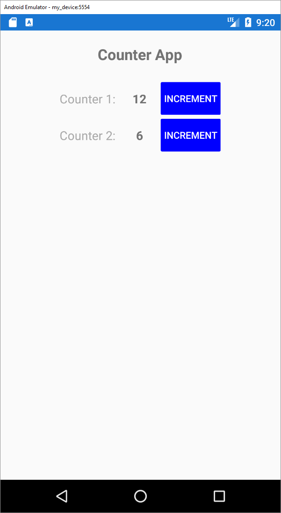

# Xamarin App
In this exercise, we are going to create a basic counter app, which will increase a counter on the screen each time the user presses a button.

## Install mobile development tools
To be able to develop mobile applications using Xamarin, you first need to install the proper tools via the Visual Studio Installer.

https://docs.microsoft.com/en-us/xamarin/get-started/installation/windows

## Go though the interactive C# tutorial
To develop in Xamarin, you’ll need to learn C#. Refresh your memory using the following online interactive tutorial.

https://docs.microsoft.com/en-us/dotnet/csharp/tutorials/intro-to-csharp/

## Create the counter app
Create a new app and call it **CounterApp**.
The idea of the app is to allow the user to increment a number on the screen using a button that is attached to it.

Design each element on the screen according to the screen shot image below.

Don’t forget to use the MVVM pattern: https://docs.microsoft.com/en-us/xamarin/xamarin-forms/enterprise-application-patterns/mvvm
* Create a view model for your main view
* Bind a command to each of the buttons and pass the counter id as a parameter
* Bind the counter number to the appropriate property on the View Model
* Make sure the app works on your real mobile phone and not only on the emulator

## **BONUS**
* Achieve the two counters (and buttons) using a list of models in your view model and a [DataTemplate](https://docs.microsoft.com/en-us/xamarin/xamarin-forms/app-fundamentals/templates/data-templates/creating).

